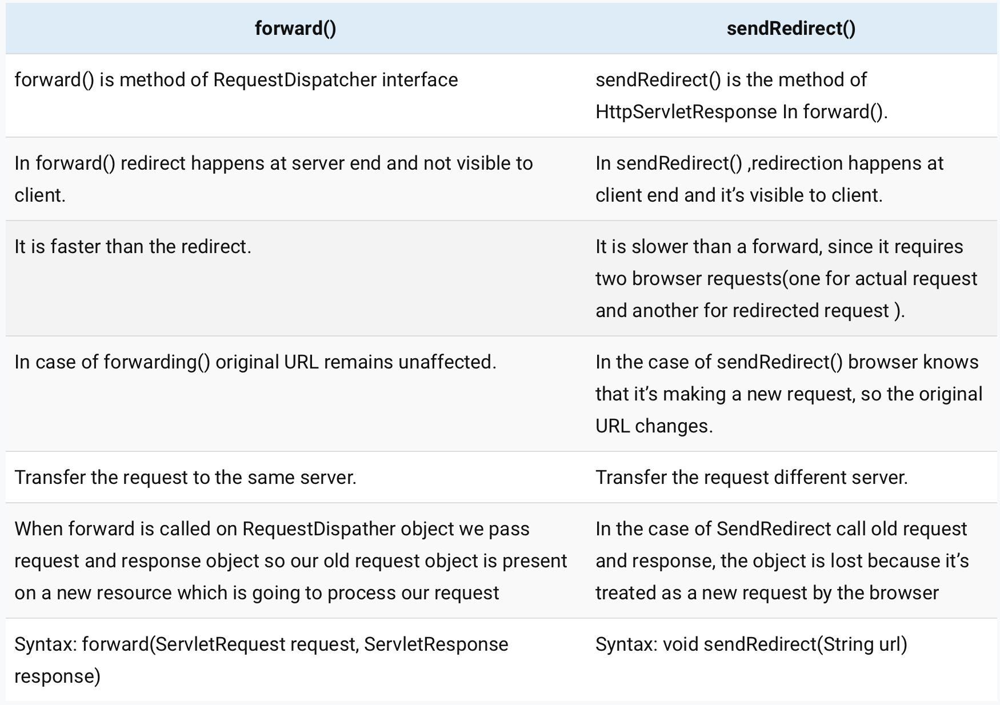
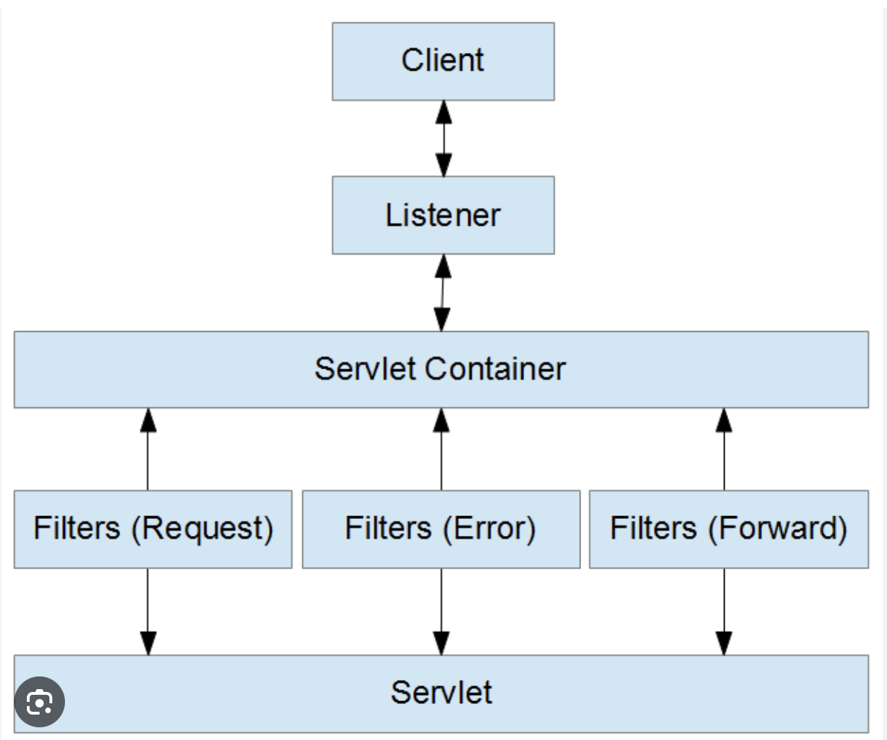
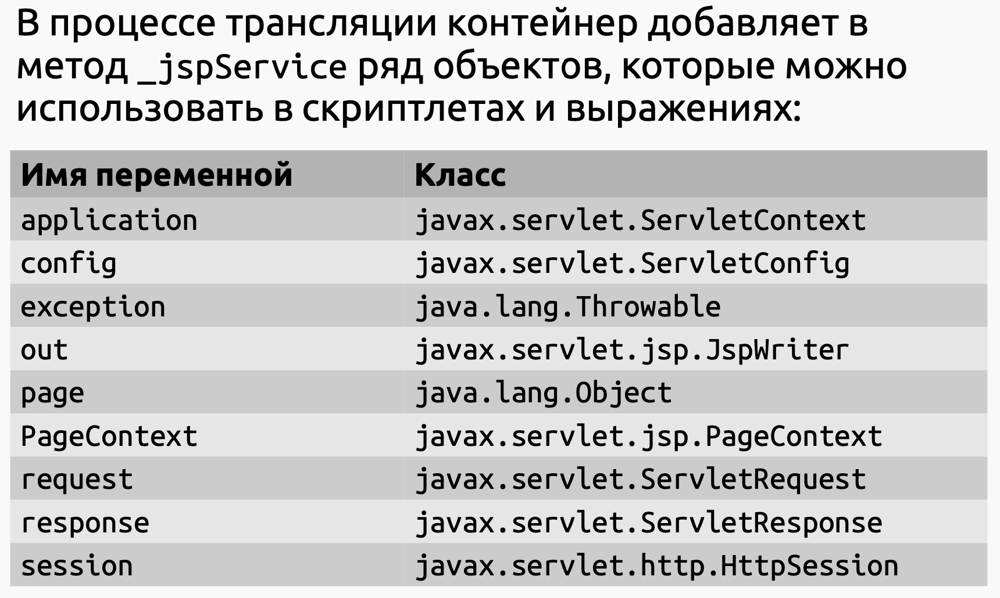
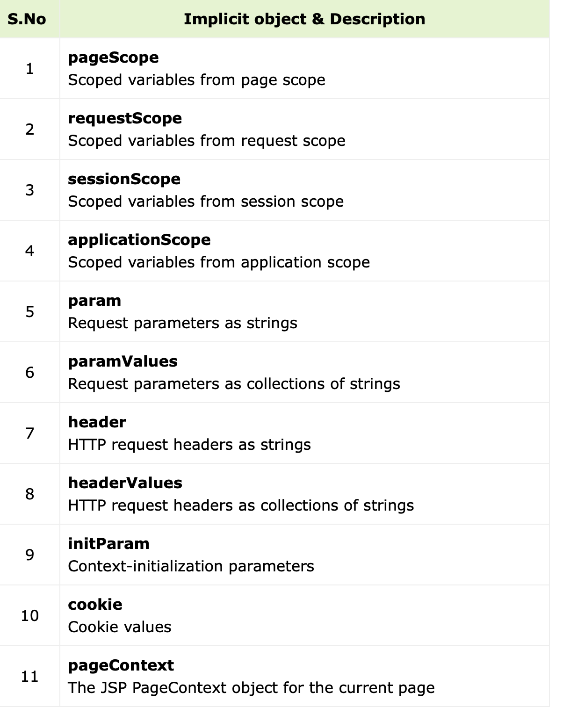
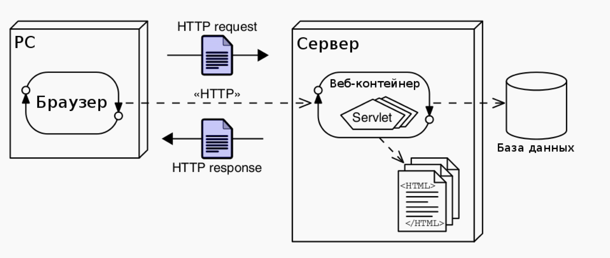
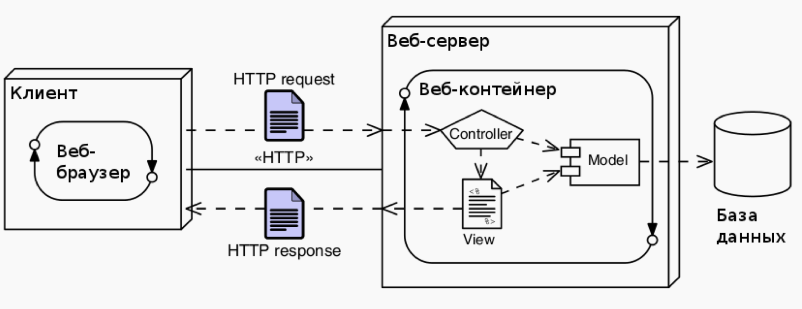
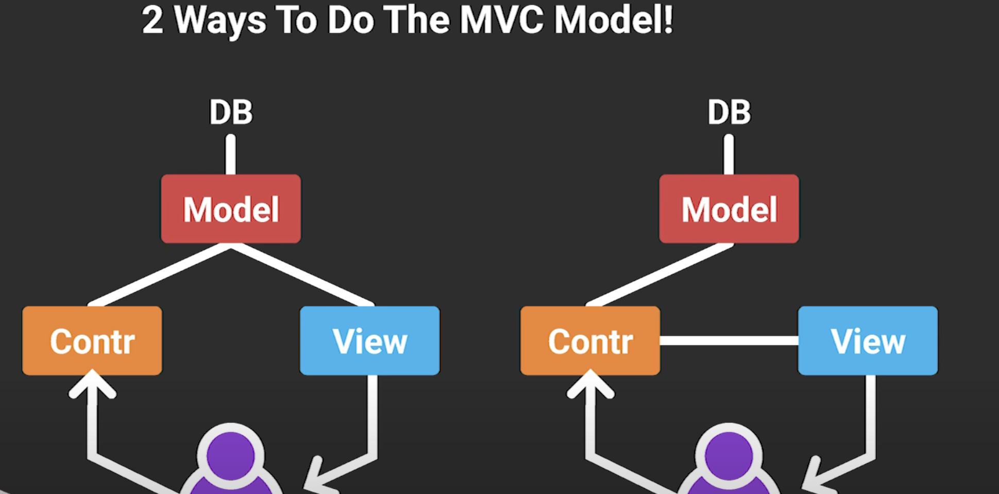

<details>
<summary style="font-size: 20px; font-weight: bold">
👞 Java-сервлеты. Особенности реализации, ключевые методы, преимущества и недостатки относительно CGI и FastCGI.
</summary>

**Сервелеты** - серверные сценарии, написанные на Java. Сам сервелет представляет собой Java-класс, который наследуется от абстрактного класса `HttpServlet` и переопределяет часть методов таких как: `doGet`, `doPost`, `doPut`, `doDelete`, (`init` и `destroy`  - для управления ресурсами в момент создания и уничтожения сервлета

Основные методы, которые можно переопределить:

- `public void init(ServletConfig config) throws ServletException`запускается сразу после загрузки сервлета в память;
- `public ServletConfig getServletConfig()`возвращает ссылку на объект, который предоставляет доступ к информации о конфигурации сервлета;
- `public String getServletInfo()`возвращает строку, содержащую информацию о сервлете, например: автор и версия сервлета;
- `public void service(ServletRequest request, ServletResponse response) throws ServletException, java.io.IOException`вызывается для обработки каждого запроса;
- `public void destroy()`выполняется перед выгрузкой сервлета из памяти.

**Преимущества относительно CGI:**

- Сервелеты предоставляют большую производительность по сравнения с CGI сценариями, так как под каждый новый запрос создается новый поток (работают внутри процесса, общие ресурсы и память), а не процесс (экземпляр программы, независимый объект, которому выделены системные ресурсы, такие как память и процессорное время). Переключение контекста между потоками быстрее, чем переключение между процессами
- Платформенная независимость сервелетов, так как они написаны на Джавке. Таким образом веб-приложение написанное с использованием сервлетов может быть запущена в любом контейнере сервлетов, реализующим этот стандарт и в любой операционной системе.
- Надежность и безопасность, так как контейнер сервелетов самостоятельно заботиться об их жизненном цикле, безопасности и сборщике мусора (безопасность еще в том плане, что при неожиданной остановки работы сервера, важные данные по-прежнему сохраняются в памяти, в отличии от cgi)
- Легкая отладка и мониторинг веб-приложения написанное на сервелетах

**Недостатки относительно CGI:**

- Из-за многопоточности возможны возникновения проблем при параллельной обработки запросов
- Слабое разделение представления и бизнес-логики

Мапинг сервелетов можно сделать в файле web.xml или в виде аннотации. Аннотации лучше использовать, если приложение небольшое. Для больших приложение web.xml будет лучше так как легче поддерживать весь мапинг

C помощью **`HttpServletRequestWrapper` and `HttpServletResponseWrapper`** можно создать свою реализацию http реквестов и респонсов в сервелетах
</details>
<br>
<details>
<summary style="font-size: 20px; font-weight: bold">
🌒 Контейнеры сервлетов. Жизненный цикл сервлета.
</summary>

**Контейнер сервелетов -** программа, которая представляет собой сервер или которая может запускаться на сервере, которая занимается системной поддержкой сервелетов и их жизненного цикла. Контейнер сервлетов обеспечивает обмен данными между сервлетом и клиентами, берёт на себя выполнение таких функций, как создание программной среды для функционирующего сервлета, идентификацию и авторизацию клиентов, организацию сессии для каждого из них.

**Обработка HTTP запроса**

1) Браузер формирует HTTP запрос и отправляет его на сервер

2) Веб-контейнер создает объекты HttpServletRequest and HttpServletResponse

3) Веб-контейнер вызывает метод `service` у сервлета, экземпляры объектов с пред шага передаются методу в качестве параметров (метод service выглядит как куча if-else if, где оределяется какой метод вызывать дальше). Сам метод service определяет тип http метода и распределяет его в соответсвующий метод. Разработчик сервелета должен переопределить соответствующий метод и реализовать его. Если разработчик не реализовал соответствующий метод то клиенту веренется ошибка 405 method not allowed

4)Сервелет формирует ответ и записывает его в поток вывода HttpServletResponse(PrintWriter)

**Жизненный цикл сервелета:**

Жизненным циклом сервелета управляет веб-контейнер, и методы жизненного цикла могут быть вызваны **только** веб-контейнером. Весь жизненный цикл по сути управляется тремя методами из интерфейса `Servlet`

1) Загрузка класса сервелета

2) Создание экземпляра класса

3) Вызов метода `init` - Инициализируется объект ServletConfig. Метод вызывает только один раз в течении всего жизненного цикла для каждого сервелета, его можно переопределить, чтобы написать какую-то логику инициализации. Обычно это происходит при переходе на url, работу которой обеспечивает сервелет, однако это поведение можно изменить. ServletConfig также предоставляет доступ к контексту сервелета

4) Далее идет обработка HTTP запроса

5) Метод `destroy()` вызывается для освобождения всех ресурсов (например, открытые файлы и соединения с базой данных) перед выгрузкой сервлета. Этот метод может быть пустым, если нет необходимости выполнения каких-либо завершающих операций. Перед вызовом метода*destroy()*сервер ждет либо завершения всех обслуживающих операций, либо истечения определенного времени. Это означает, что метод*destroy()*может быть вызван во время выполнения какого-либо продолжительного метода*service()*.

Важно оформить метод*destroy()*таким образом, чтобы избежать закрытия необходимых ресурсов до тех пор, пока все вызовы*service()*не завершатся.

Метод также вызывается только один раз в течении жизненного цикла серевелета

Можно сделать так, чтобы сервелет грузился не во время поступления первого запроса, а сразу после запуска сервера с помощью тега `loadonstartup` . Дефолтное значение -1, чем выше значение тем позднее будет загружен сервелет

Можно сделать дедлок в сервелет, вызвав doPost inside doGet and vice versa
</details>
<br>
<details>
<summary style="font-size: 20px; font-weight: bold">
🚪  Диспетчеризация запросов в сервлетах. Фильтры сервлетов.
</summary>

**Диспетчерезация** (перенаправление). Сервелеты могут перенаправлять или делегировать запрос другим серевелетами, jsp страницам

Само перенаправление осуществляется с помощью реализации интерфейса RequestDispatcher. Есть два способа получить объект диспатчера, через ServletRequest (абсолютный или относительный url) и через ServletContext (только абсолютный путь)



```jsx
getServletContext().getRequestDispatcher(address).forward(req, resp)
```

Различие между include и forward заключается в том, что при include контроль сохраняется у сервелета, который вызвал include и результат работы страницы, на которую перешел запрос при include будет в странице, который вызвала include

Хороший пример:

> The difference between the two tags is that the way they work. Well, I will say an example so that you can imagine it better.
>
>
> Assume you have two pages, pageA, and pageB. In pageA you wrote the include tag. In this case the control was in pageA til you called the include tag. At this point the full control goes to pageB. When It's done, control is returned to pageA starting from the next point of coding after the include tag and continuing to the rest of pageA.
>
> Well, to get things much clearer, let's say that we have the same pages, pageA and pageB, but this time we will use the forward tag in pageA, not the include tag. Again, the control will begin in pageA till we call the forward tag in pageA, at this point, control is transfered to pageB, just like the include tag. But the difference is what happens when pageB completes. In case of the forward tag, control doesn't go back to pageA again.
>

**Фильтры**

Фильтр - классы, который имплементирует  интерфейс `Filter` , которые могут осуществлять пред и пост обработку запросов до передачи их ресурсу или после обработки запроса ресурсом с помощью переопределния метода `doFilter` . Возможна организации цеопчки фильтров, которые могут обрабатывать один и тот же запрос с помощью   `filterChain.doFilter()` класса `FilterChain`

Без передачи запроса на обработку другим фильтрам сервелет никогда не получить сам запрос

В самом интерфейсе фильтра находится три метода. inint, doFilter, destory

Мапинг можно делать как в случае с сервелетами, с помощью аннотации или в веб-дескрипторе

То в каком порядке выполняться фильтры решает контейнер, но вообще обычно это происходит в том порядке, в котором мы указываем в дескрипторе, однако гарантии нет
</details>
<br>
<details>
<summary style="font-size: 20px; font-weight: bold">
🎄 HTTP-сессии - назначение, взаимодействие сервлетов с сессией, способы передачи идентификатора сессии.
</summary>

**HTTP-сессия -** представляют способ сохранения состояния между запросами и ответами на веб-сервере, так как сам по себе http протокол не хранит состояние.

Для реализации сессий на сервелетах используется интерфейс `HttpSession`, он позволяет идентефицировать клиента, присваивая ему id, при множественной обработки запросов от одного клиента. Сам экземпляр `HttpSession` создается при первом обращении клиента к приложению и сохраняется определенное кол-во времени, после последнего запроса (дефолтное значение 1800 секунд, однако его можно настроить. Значение -1 указывает, что сессия удаляется только тогда, когда пользователь закрыл вкладку в браузере.). **ID сессии либо помещается в куки, либо добавляется к URL (как-то через encodeURL)**

Значения в сервелетах можно сохранять в виде пары ключ/значение, это можно сделать с помощью методов `set/getAttribute`. Все сервелеты могут положить/получить данные из сессии

Данные сессии связаны с конкретным пользователем и будут доступны только для этого пользователя в течение жизни сессии.

Сессия привязана к одному приложению и в рамках одного приложения сессия гарантирована будет одинаковой

**`invalidate()`**: удаляет из сессии все объекты

**`isNew()`**: возвращает true, если для клиента еще не установлена сессия (клиент сделал первый запрос или на клиенте отключены куки)

В распределенных приложения вне зависимости от количества экземпляров JVM окружение пытается сохранять целостность сессии
</details>
<br>
<details>
<summary style="font-size: 20px; font-weight: bold">
🎳 Контекст сервлета - назначение, способы взаимодействия сервлетов с контекстом.
</summary>

**Контекст сервелета** - API, с помощью которого сервелет может взаимодействовать со своим контейнером

Объект `ServletContext` можно получить вызывая метод `getServletContext` интерфейса `ServletConfig`

У всех сервелетов общий контекст, то есть все сервелеты внутри одного приложения могут достать данные из контекста

Доступ к методам осуществляется через интерфейс ServletContext

В контекст можно помещать общую для всех сервелетов информацию с помощью методов `setAttribute` and `getAttribute`

В распределенных приложениях на каждый экземпляр JVM создается свой контекст

---



Также присутствуют слушатели. Они срабатывают первыми при получении запроса от клиента. Существуют различные слушатели, например: **`javax.servlet.ServletContextListener`, `javax.servlet.ServletContextAttributeListener`, `javax.servlet.http.HttpSessionListener`, `javax.servlet.http.HttpSessionAttributeListener`, `javax.servlet.http.HttpSessionActivationListener`**

С помощью слушателей удобно создавать коннекшен к бд. Отличие от фильтров (в моем понимании), так это то что они работают как триггеры, то есть вызываются только при каком-либо эвенте, в отличие от фильтров, которые срабаютывают всегда (при получении запроса или отправки ответа)
</details>
<br>
<details>
<summary style="font-size: 20px; font-weight: bold">
🪙 JavaServer Pages. Особенности, преимущества и недостатки по сравнению с сервлетами, область применения.
</summary>

**JSP(JavaServerPages) -** технология в мире веб-разработки, позволяющая создавать содержимое, которое имеет как статические (HTML) компоненты, так и динамические такие как JSP-компоненеты, а также просто java код. **Платформонезависимая** **переносимая** и **легко расширяемая технология** разработки веб-приложений, позволяющая веб-разработчикам создавать содержимое, которое имеет как статические, так и динамические компоненты.  При загрузке jsp страницы в веб-контейнер она транслируется компилятором Jasper в обычный сервелет с кучей sout-ов. JSP страницы отделяют бизнес-логику от представления (если ипользовать вместе с сервелетами)

Еще одним преимуществом JSP является **горячее развертывание** - возможность заменить одну страницу на другую непосредственно в контейнере без необходимости перекомпилировать весь проект или перезапускать сервер

**Преимущества JSP над сервелетами:**

- JSP страницы легче поддерживать, так как его синтаксис такой же как в HTML это лучше чем ад sout-ов
- JSP по сути расширение сервелетов, которое добавляет удобную верстку + можно юзать все приколы сервелетов
- Легко для понимания
- Можно менять документ jsp и в runtime при след обращении к странице она должна обновится (какая-то иммитация интерпретирования (хз у меня почему-то jsp так не обновляется))
- Меньше кода чем в сервелетах

**Недостатки JSP над сервелетами:**

- Медленнее чем, сервелет, так как сначала jsp должен странслироваться в код сервелета
- Принимает только HTTP протокол в отличие от сервелета  ???
- Трудно отлаживать, если приложение целиком основано на jsp

JSP лучше использовать как предстлавение, чтобы отделить бизнес-логику (писать ее в сервелетах) от представления
</details>
<br>
<details>
<summary style="font-size: 20px; font-weight: bold">
🪡 Жизненный цикл JSP.
</summary>

1) Трансляция jsp в сервелет

2) Компиляция странслированного jsp документа

3) Загрузка сервелета веб-контейнером

4) Создается экземпляр класса

5) Вызывается метод `jspInit` method is invoked, то есть инициализация сервелета

6) Обработка запросов, вызвается метод `_jspService.`  Отметьте, что имя метода начинается с нижнего подчеркивания и отличается от других методов жизненного цикла тем, что его невозможно переопределить. Весь JSP код проходит через этот метод и он переопределен по умолчанию. Этот метод определен в HttpJspPage интерфейсе.

7) Вызов метода `jspDestroy`
</details>
<br>
<details>
<summary style="font-size: 20px; font-weight: bold;">
🥍 Структура JSP-страницы. Комментарии, директивы, объявления, скриптлеты и выражения.
</summary>

Сама структура JSP-страницы в точности похожа на html докуммент

**Комментарии**

Поддерживается три типа коммнтариев

```java
<!-- HTML comment style --> Так как это html стиль, то этот комментарий будет виден в response 
<%-- JSP comment style --%> Будет виден только в jsp странице, и не будет видет в респонсе или в коде сервелета
<% Java comments %> Будте показан в коде сервелета и не будет виден в респонсе
```

**Директивы**

Директивы - “сообщения” jsp контейнеру, с помощью которых можно управлять процессом траснляции страницы в сервелет

**Всего бывает три вида директив:**

1) Page - Позволяет задавать параметры, используемые контейнером при управлении жизненным циклом страницы.

Располагается вначале страницы

```java
<%@ page import="java.util.List"%> - позволяет задавать пакеты, которые должны быть импортированы 
<%@ page buffer="16kb"%> - позволяет задать размер буефера для потока вывода сервелета. Дефолтное значение 8кб. Если значение равно none вывод происходит непосредственно в объект ServletResponse
<%@ page contentType="application/msword"%> - задает Content Type и кодировку страницы
extends - позвляет задать родительский класс от которого будет наследоваться сервелет. Используется редко
info - задает текст, который можно получить с помощью метода getServletInfo()
language - задает язык, по умолчанию Java
isELIgnored - будут ли игнорироваться EL выражения
isThreadSafe - если == false то сервелет будет блокировать параллельную обработку нескольких запросов. Буде работать медленно, но надежно
errorPage - позволяет указать страницу, на которую будет перенаправляться при возникновении исключения
autoFlush - указывает будет ли автоматически выгружаться буфер при его переполнении
session - можно задать будет ли создавться сессия
```

2) include - позволяет вставлять текст или код во время трансляции страницы

```java
<%@ include file="path to file"%>
```

Заданный URI обычно интерпретируется относительно JSP страницы, на которой расположена ссылка, но, как и при использовании любых других относительных URI, можно задать системе положение интересующего ресурса относительно домашнего каталога WEB-сервера добавлением в начало URI символа "/". Содержимое подключаемого файла обрабатывается как обычный текст JSP и поэтому может включать такие элементы, как статический HTML, элементы скриптов, директивы и действия.

3) taglib - объявляет, что данная страница использует библиотеку, уникальным образом идентифицируя ее с помощью URI, и ставит в соответствие префикс тега, с помощью которого возможны действия в библиотеке. Если контейнер не может найти библиотеку тегов, возникает фатальная ошибка трансляции.

```java
<%@ taglib uri="URI включаемой библиотеки тегов" prefix="имяПрефикса" %>
```

**Объявления**

Предназначены для объявления переменных и методов, которые в дальнейшем используются в jsp странице

```java
<%! String s = "Hello, World!"; %>
<%! public int adding (int a, int b){return a + b}; %>
```

**declarations**не производят никакого вывода в стандартный выходной поток*out*. Переменные и методы, декларированные в объявлениях, инициализируются и становятся доступными для скриптлетов и других*объявлений*в момент инициализации страницы JSP.

**Скриптлеты**

Позволяют писать java code (или на любом другом языке, определенном в директиве language), который будет исполняться при обработке запросов (при вызове методы jspService)

```java
<% JavaCode %>

<% if (Calendar.getInstance ().get (Calendar.AM_PM) == Calendar.AM) {%>
   Good Morning 
<% } else { %>
   Good Afternoon 
<% } %>

Скриплеты имеют доступ к тем же автоматически определенным переменным, что и выражения. 
Поэтому, например, если есть необходимость вывести какую-либо информацию на страницу, 
необходимо воспользоваться переменной out.

<% 
    String queryData = request.getQueryString (); 
    out.println ("Дополнительные данные запроса: " + queryData); 
%>
```

**Выражения**

Исполняемое выражение, написанное на языке скрипта, указанного в объявлении language (как правило Java). Результат*выражения*JSP, имеющий обязательный тип String, направляется в стандартный поток вывода*out*с помощью текущего объекта*JspWriter*. Если результат*выражения*не может быть приведен к типу*String*, возникает либо ошибка трансляции, если проблема была выявлена на этапе трансляции, либо возбуждается исключение*ClassCastException*, если несоответствие было выявлено в процессе выполнения запроса

```java
<%= new java.util.Date () %>
```

**JSP Actions**

Позволяют управлять поведением сервелета

```java
<jsp:action_name attribute="value" />
jsp:include - включение в страницу внешних файлов. Отличие от директивы в том, что action работает в runtime => будт при каждом обращении
инклюдить внешний ресурс в отличие от директивы, которая заинклюдит тольок при транспиляции

jsp:useBean - Добавляет на страницу экземпляр Java Bean с заданным контекстом.
jsp:set/getProperty - Получение и установка свойств Java Bean.
jsp:forward - Перенаправление на другую страницу.
```
</details>
<br>
<details>
<summary style="font-size: 20px; font-weight: bold;">
🕐 Правила записи Java-кода внутри JSP. Стандартные переменные, доступные в скриптлетах и выражениях.
</summary>


Правила записи Java кода внутри jsp точно такое же как и в сервелетах, в зависимости от jsp элемента, где мы пишем сам код
</details>
<br>
<details>
<summary style="font-size: 20px; font-weight: bold">
🎪 Bean-компоненты и их использование в JSP
</summary>

JavaBean - простой Java-класс, написанный по определенным правилам. Любой класс Java, который соответствует определенным требованиям проектирования, может быть компонентом JavaBeans. Это одноуровневые объекты, использующиеся для того, чтобы инкапсулировать в одном объекте код, данные или и то и другое. Компонент JavaBean может иметь свойства, методы и события, открытые для удаленного доступа.

Класс Java Bean должен соответствовать ряду ограничений:

- иметь конструктор, который не принимает никаких параметров
- все поля приватные
- определять для всех свойств, которые используются в jsp, методы геттеры и сеттеры
- названия геттеров и сеттеров должны соответствовать условностям: перед именем переменной добавляется get (для геттера) и set (для сеттера), а название переменной включается с большой буквы. Например, если переменная называется firstName, то функции геттера и сеттера должны называться соответственно getFirstName и setFirstName.

  Однако для переменных типа boolean для функции геттера используется вместо get приставка is. Например, переменная enabled и геттер isEnabled.

- реализовать интерфейс Serializable или Externalizable
- Класс должен иметь переопределенные методы equals(), hashCode() и toString().

**Использование в JSP**

```java
jsp:useBean - Добавляет на страницу экземпляр Java Bean с заданным контекстом.
jsp:set/getProperty - Получение и установка свойств Java Bean.

<jsp:useBean id="beanName"
   class="fully_qualified_classname" scope="scope"/>
<jsp:getProperty name="beanName" property="nameOfProperty"/>
```

**Scopes of jsp page**

- **page**‘page’ scope means, the JSP object can be accessed only from within the same page where it was created. The default scope for JSP objects created using <jsp:useBean> tag is page. JSP implicit objects out, exception, response, pageContext, config and page have ‘page’ scope.
- **request**A JSP object created using the ‘request’ scope can be accessed from any pages that serves that request. More than one page can serve a single request. The JSP object will be bound to the request object. Implicit object request has the ‘request’ scope.
- **session**‘session’ scope means, the JSP object is accessible from pages that belong to the same session from where it was created. The JSP object that is created using the session scope is bound to the session object. Implicit object session has the ‘session’ scope.
- **application**A JSP object created using the ‘application’ scope can be accessed from any pages across the application. The JSP object is bound to the application object. Implicit object application has the ‘application’ scope.
</details>
<br>
<details>
<summary style="font-weight: bold; font-size: 20px">
🃏 Стандартные теги JSP. Использование Expression Language (EL) в JSP.
</summary>

**JSP Standard Library Tag(JSTL) -** расширение jsp, добавляющее возможность использовать дополнительные теги для решения типовых задач (условия, циклы, интернационализация). Так как эти типовые задачи на джава могут оказаться достаточно громоздкими, поэтому и создали стандартную билиотеку тегов, которые разрешают данные проблемы

Рекомендуется их использование вместе с EL вместо скриплетов

Библиотека не является частью Java EE или Джакарты, поэтому ее нужно скачивать или добавлять в зависимость

Для подключения библиотеки на jsp страницу нужно написать директиву taglib

```
<%@ taglib uri="http://java.sun.com/jsp/jstl/core" prefix="c" %>
```

Несмотря на то, что JSTL называют библиотекой на самом деле в ней содержится несколько библиотек

- **Core**: содержит основные теги для наиболее распространенных задач (циклы, условия, вывод на экран).

  Использует префикс "c" и uri "http://java.sun.com/jsp/jstl/core"

  Examples:

    ```
    <c:out value="hello also can write EL"/> - вывести на экран
    --------------
    <c:set var = "salary" scope = "session" value = "${2000*2}"/> - set scrope varibale
    --------------
    <c:choose> - like if else. test is required
             
             <c:when test = "${salary <= 0}">
                Salary is very low to survive.
             </c:when>
             
             <c:when test = "${salary > 1000}">
                Salary is very good.
             </c:when>
    </c:choose>
    -----------
    <c:forEach var = "i" begin = "1" end = "5"> - loop. can use item variable to itearate for example over collection
             Item <c:out value = "${i}"/><p>
    </c:forEach>
    -------------
    <c:redirect url = "http://www.photofuntoos.com"/> - redirects to given url. **context**	/ followed by the name of a local web application
    ```

- **Formatting**: предоставляет теги для форматирования чисел, дат, времени.

  Использует префикс "fmt" и uri "http://java.sun.com/jsp/jstl/fmt"

  Examples:

    ```
    <fmt:formatNumber value="num"/> 
    maxFractionDigits="2" - round number
    pattern="" - custom format pattern
    ----------------
    <fmr:parseNumber value=""/>
    ----------------
    <fmt:parseDate value="date value"/>
    type= "DATE, TIME, BOTH"
    dateStyle="FULL, LONG, MEDIUM, SHORT, or DEFAULT"
    timeStyle="same as date style"
    pattern="custom pattern"
    ----------------
    Also some tags for localization
    ```

- **SQL**: предоставляет теги для работы с sql-запросами и источниками данных.

  Использует префикс "sql" и uri "http://java.sun.com/jsp/jstl/sql"

  Example:

    ```
    <sql:setDataSource var = "snapshot" driver = "com.mysql.jdbc.Driver"
             url = "jdbc:mysql://localhost/TEST"
             user = "user_id"  password = "mypassword"/>
    <sql:query dataSource = "${snapshot}" sql = "..." var = "result" />
    ----------------------
    ```

- **XML**: предоставляет теги для работы с xml.

  Использует префикс "x" и uri "http://java.sun.com/jsp/jstl/xml"

- **Functions**: предоставляет функции для работы со строками.
  
  Использует префикс "fn" и uri "http://java.sun.com/jsp/jstl/functions"

  Examples:

    ```
    <c:set var = "theString" value = "I am a test String"/>
    
          <c:if test = "${**fn:contains(theString, 'test')**}">
             <p>Found test string<p>
          </c:if>
    
          <c:if test = "${fn:contains(theString, 'TEST')}">
             <p>Found TEST string<p>
          </c:if>
    ------------------
    <c:set var = "string1" value = "This is first String."/>
          <c:set var = "string2" value = "This is second String." />
          <p>Length of String (1) : ${**fn:length(string1)**}</p>
          <p>Length of String (2) : ${**fn:length(string2)**}</p>
    ------------------
    
    ```


**EL(Expression Language)**

Расширение JSP, позволяющее удобно работать с JavaBean компонентами, позволяет удобно получать к ним доступ, а также к массивам, коллекциям

Позволяет использовать арифметические и логичкие выражения на странице

Синтаксис у таких выражений `${expression}`

**Список неявных объектов, которые доступны в EL**


</details>
<br>
<details>
<summary style="font-weight: bold; font-size: 20px">
🏤 Параметры конфигурации JSP в дескрипторе развёртывания веб-приложения.
</summary>

JSP можно сконфигурировать как обычный сервелет

```java
<servlet>
        <servlet-name>INDEX</servlet-name>
        <jsp-file>/index.jsp</jsp-file>
    </servlet>
    <servlet-mapping>
        <servlet-name>INDEX</servlet-name>
        <url-pattern>/main</url-pattern>
    </servlet-mapping>
```

Можно задать параметры с помощью тега `<init-param></init-param>`

Можно также задать taglib и в дескрипторе укказать бибилотеку

```java
<jsp-config>
        <jsp-property-group>
            <description>Special property group for JSP Configuration JSP example.</description>
            <display-name>JSPConfiguration</display-name>
            <url-pattern>/jsp/* </url-pattern>
            <el-ignored>true</el-ignored>
            <page-encoding>GB2312</page-encoding>
            <scripting-invalid>true</scripting-invalid>
        </jsp-property-group>
    </jsp-config>
```
</details>
<br>
<details>
<summary style="font-size: 20px; font-weight: bold">
🏓 Шаблоны проектирования и архитектурные шаблоны. Использование в веб-приложениях.
</summary>

**Архитектурные шаблон -** обобщенное часто используемое решение распространенной задачи в архитектуре ПО в заданном контексте.

Более высокий уровень по сравнению с шаблонами проектирования, описывают архитектуру всей системы или приложения, имеют дело с компонентами или модулями, сами компоненты уже могут быть построены с помощью шаблоном проектирования

Все веб-приложения можно разделить на три слоя: Клиент, Бизнес-Логика и Данные. Такой подход разделения приложения на три состовляющие удобен так как в больших проектах все три слоя обычно пишутся разными людбми. Типичное веб-приложение многослойное

[Самые важные архитектурные шаблоны, которые нужно знать. Статься на хабре](https://habr.com/ru/companies/alconost/articles/522662/)
</details>
<br>
<details>
<summary style="font-weight: bold; font-size: 20px">
⚖️ Архитектура веб-приложений. Шаблон MVC. Архитектурные модели Model 1 и Model 2 и их реализация на платформе Java EE.
</summary>

**Архитектура Model 1**



Для небольших приложений, обработка данных и представления выполняется одним и тем же компонентом будь то JSP или Servlet. Сложно расширять и поддерживать

**Архитектура Model 2 или MVC(Model View Controller)**



Подходит для проектирования сложных систем, в отличие от модели 1 за обработкуи и представление отвечают разные компоненты. В простом случае уровень модели сам будет ходить в базу и подготваливать данные для представления, однако в сильно сложных системах под уровнем модели есть некоторые сервисы, которые будут доставать данные из БД и отдавать их модели, чтобы она подготовила их для представления

**MVC**

Model - Это основная логика приложения. Отвечает за данные, методы работы с ними и структуру программы. Модель реагирует на команды из контроллера и выдает информацию и/или изменяет свое состояние. Она передает данные в представление. Не взаимодействует с пользователем напрямую

View - Задача компонента — визуализация информации, которую он получает от модели. View отображает данные на уровне пользовательского интерфейса. Например, в виде таблицы или списка. Представление определяет внешний вид приложения и способы взаимодействия с ним.

Controller - Он обеспечивает взаимодействие с системой: обрабатывает действия пользователя, передает ее модели. Контроллер определяет, как приложение будет реагировать на действия пользователя. Также контроллер может отвечать за фильтрацию данных и авторизацию.


</details>