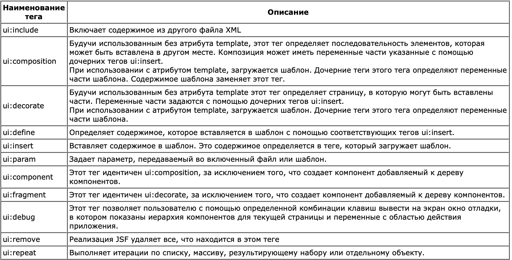
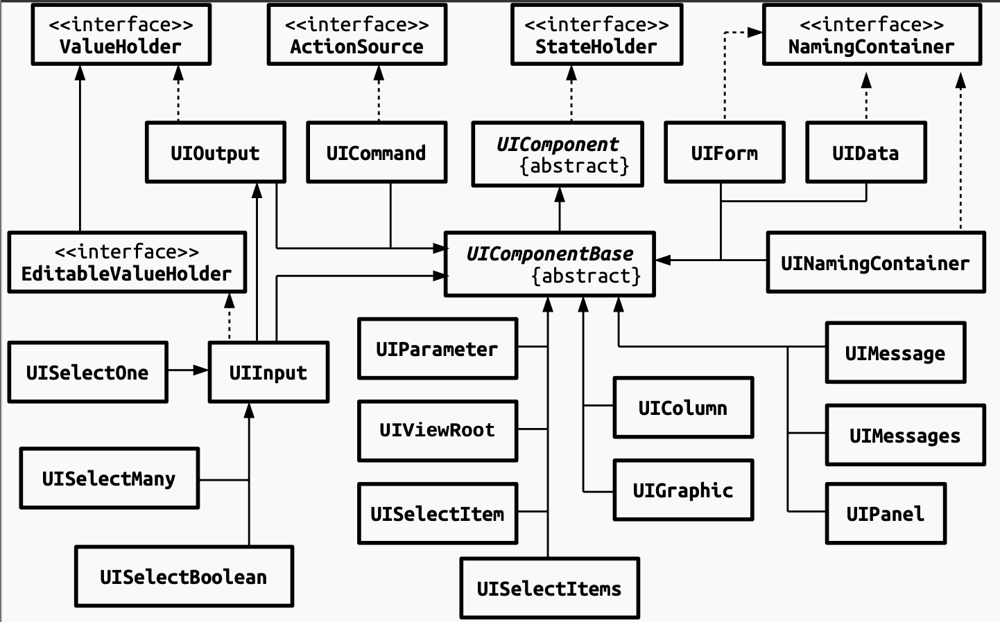
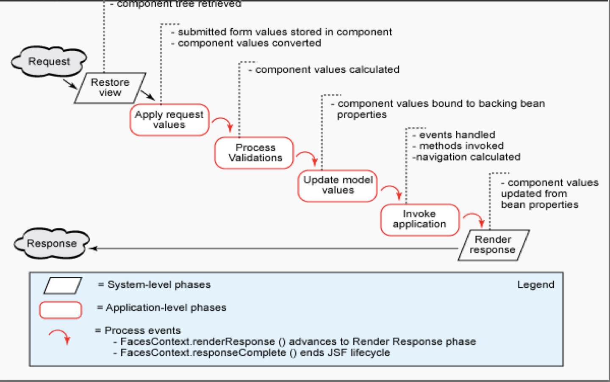
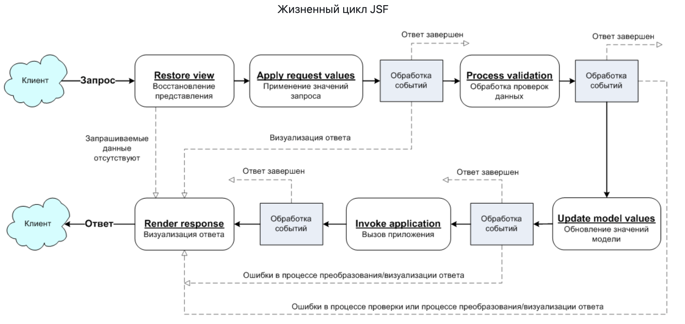
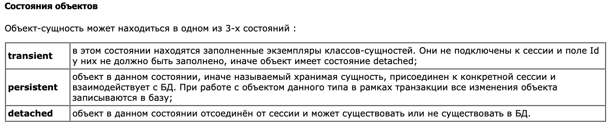
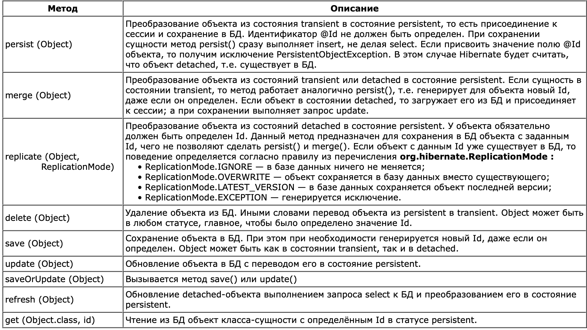

<details>
<summary style="font-weight: bold; font-size: 20px">
1 Технология JavaServer Faces. Особенности, отличия от сервлетов и JSP, преимущества и недостатки. Структура JSF-приложения.
</summary>

**JavaServer Faces (JSF) -** это фреймворк для веб-приложений, для разработки пользовательских интерфейсов Java EE приложений. Основывается на использовании компонентов. Состояние компонентов пользовательского интерфейса сохраняется, когда пользователь запрашивает новую страницу и затем восстанавливается, если запрос повторяется.

Технология JavaServer Faces включает набор API для представления компонент пользовательского интерфейса (UI) и управления их состоянием, обработкой событий и валидацией вводимой информации, определения навигации, а также поддержку интернационализации (i18n) и доступности (accessibility).

В качестве контроллера выступает специальный FacesServlet

**Приемущества:**

- Четкое разделение бизнес-логики и интерфейса
- Управление обменом данными на уровне компонент
- Простая работа с событиями на стороне сервера
- Расширяемость (можно использовать дополнительные компоненты)
- Доступность нескольких реализаций от различных компаний-разработчиков

**Недостатки:**

- Из-за высокоуровневости фреймворка сложна реализовывать непредусмотренные авторами функциональность
- Сложно разрабатывать свои компоненты

**Структура JSF-приложения:**

- JSP или XHTML страница с набором компонентов
- Библиотеки тегов
- Управляемые бины
- Доп компоненты (конверторы, валидаторы, компоненты)
- faces.config.xml опциональная штука (при конфликте с аннотациями имеет больший приоритет)
- web.xml

    ```xml
    <servlet>
            <servlet-name>Faces Servlet</servlet-name>
            <servlet-class>javax.faces.webapp.FacesServlet</servlet-class>
            <load-on-startup>1</load-on-startup>
        </servlet>
        <servlet-mapping>
            <servlet-name>Faces Servlet</servlet-name>
            <url-pattern>*.xhtml</url-pattern>
        </servlet-mapping>
    ```

    - Если коротко, то здесь декларируется, так называемый, Faces Servlet, который будет отвечать за обработку всех страниц, имеющих расширение xhtml. Faces сервлет являются частью JSF и поставляется вместе с подключенными зависимостями. Он будет выполнять роль Controller'а в нашем MVC-фреймворке.
</details>
<br>
<details>
<summary style="font-size: 20px; font-weight: bold;">
2 Использование JSP-страниц и Facelets-шаблонов в JSF-приложениях.
</summary>

  **JSP in JSF**

  Можно использовать JSF теги внутри JSP. Для этого их нужно импортировать через директиву taglib:

  `<%@ taglib uri="http://java.sun.com/jsf/html" prefix="h" %>`

  `<%@ taglib uri="http://java.sun.com/jsf/core" prefix="f" %>`

  Затем можно использовать как и в обычном xhtml.

  Однако считается устаревшим и не поддерживается, сейчас надо использовать facelet шаблоеы

  **Facelets in JSF**

  **Facelets**— открытый веб-фреймворк, который распространяется под лицензией Apache license и является технологией управления представлением для**JSF**(Java Server Faces). Технология Facelets была изначально разработана как альтернатива обработчику представлений на основе**JSP**, применявшемуся в ранних версиях JSF. В версии JSF 2.0 Facelets заменила JSP в качестве применявшейся по умолчанию.

  Фреймворк**Facelets**требует для функционирования валидные**XML**документы. Поэтому веб-страницы создаются с использованием языка разметки XHTML.

  C помощью faclets шаблонов можно создать единый шаблон, который может быть использован в нескольких приложениях

  Небольшая таблица с основными facelets тегами для создания шаблонов

  


    template.xhtml
    <h:head>
        <meta name="viewport" content="width=device-width, initial-scale=1.0"/>
        <h:outputStylesheet library="style" name="main-style.css"/>
        <ui:insert name="title">
            <title>Lab3 #2323</title>
        </ui:insert>
    </h:head>
    
    <h:body>
        <div class="main">
            <ui:insert name="content"/>
        </div>
    
        <ui:insert name="js"/>
    </h:body>
    
    </html>
    
    main.xhtml
    <ui:composition template="templates/template.xhtml">
    		<ui:define name="title">
    				<title> Some title </title>
    		</ui:define>
    		<ui:define name="content">
    				some code
    		</ui:define>
    		<ui:define name="js">
    				some output scripts
    		</ui:define>
    </ui:composition>
    

  Если в странице не переопределяются шаблонные компоненты, то они останутся как по умолчанию
</details>
<br>
<details>
<summary style="font-size: 20px; font-weight: bold">
3 JSF-компоненты - особенности реализации, иерархия классов. Дополнительные библиотеки компонентов. Модель обработки событий в JSF-приложениях.
</summary>


  **Особенности реализации JSF-компонентов:**

  - Интерфейс строится из компонентов
  - Компоненты расположены на facelets шаблонах
  - Компоненты реализуют абстрактный класс `javax(jakarta).face.component.UIComponent`
  - Можно создавать новые компоненты (создать новый xhtml где мы опишем новый тег, создать *.taglib.xml, зарегестрировать в web.xml)

    ```xml
    *.taglib.xml
    <?xml version="1.0" encoding="UTF-8"?>
    <facelet-taglib 
        xmlns="http://java.sun.com/xml/ns/javaee"
        xmlns:xsi="http://www.w3.org/2001/XMLSchema-instance"
        xsi:schemaLocation="http://java.sun.com/xml/ns/javaee http://java.sun.com/xml/ns/javaee/web-facelettaglibrary_2_0.xsd"
        version="2.0">
        <namespace>http://example.com/jsf/facelets</namespace>
        <tag>
            <tag-name>some</tag-name>
            <source>tags/some.xhtml</source>
        </tag>
    </facelet-taglib>
    
    web.xml
    <context-param>
        <param-name>javax.faces.FACELETS_LIBRARIES</param-name>
        <param-value>/WEB-INF/example.taglib.xml</param-value>
    </context-param>
    
    main.xhtml
    <html ... xmlns:my="http://example.com/jsf/facelets">
    ...
    <my:some />
    ```

  - Компоненты на странице объеденины в деревовидную структуру - представление (представление типо как DOM дерево в браузере, оно синхронизируется с тем, что происходит в браузере)
  - Корневым элементов представления является экземпляр класса `javax.faces.component.UIViewRoot.`

  **Иерархия классов**

  

  **Дополнительные библиотеки компонентов**

  Самые популярные: PrimeFaces, ICEfaces, RichFaces

  Предоставляют нестандартные наборы ввода типа слайдеров, спинеров, способы вывода ошибок. В общем куча компонентов, которые сложно сделать на голом html

  В PrimeFaces также можно довольно просто менять стили у уже готовых компонентов

  **Модель обработки событий в JSF-приложениях**

  

  

  Фазы:

  1) Фаза формирования представления (Restore View Phase)

  - JSF Runtime формирует представление начиная с UIViewRoot
    - Создаются объекты компонентов
    - Назначаются слушатели событий, конверторы и валидаторы
    - Все элементы представления помещаются в FacesContext
  - Если это первый запрос то формируется пустое представление (создается новое дерево представления)
  - Если запрос уже к существующей странице, то JSF Runtime синхронизирует состояние компонентов с представлением клиента (с ДОМ деревом)

  2) Фаза получения значений компонентов (Apply request values)

  - На клиенте все значения хранятся в строков формате ⇒ вызывается конвертер в соответствии с типом данных значений
  - Если конвертация заканчивается успешно, то значение сохраняется в локальной переменной компонента (типа submittedValue для inputText) тк валидация еще не прошла
  - Если нет - то создается сообщение об ошибке, которое помещается в FacesContext

  3) Фаза валидации значений компонентов (Process Validation)

  - Вызываются валидаторы, зарегестрированные для компонентов представления
  - Если валидация не проходит, то формируется сообщение об ошибке, которое помещается в FacesContext

  4) Фаза обновления значений компонентов (Update model values)

  - Если данные валидны, то значение компонента обновляется
  - Новое значение присваивается полю объекта компонента

  5) Фаза вызова приложения (Invoke Application Phase)

  - Управление передается слушаетлям собтиый
  - Формируются новые значения компонентов

  6) Фаза формирования ответа сервера (Render Response Phase)

  - JSF Runtime обновляет представление в соответсвии с результатом обработки запроса
  - Если это первый запрос к странице, то компоненты помещаются в иерархию представления
  - Формируется ответ сервера на запрос
  - На стороне клиента происходит обновление страницы
  - Кроме генерации ответа на данном этапе происходит сохранение текущего состояния вида, обеспечивая возможность его восстановления при последующих обращениях к странице.
  - По завершении рендеринга конечное состояние вида должно быть сохранено посредством методов классаStateManager.
</details>
<br>
<details>
<summary style="font-size: 20px; font-weight: bold">
4 Конвертеры и валидаторы данных.
</summary>


  ### Конвертеры


  - Используются для преобразования данных компонента в заданный формат(дата, число и так далее)
  - Реализуют интерфейс javax(jakarta).faces.converter.Converter
  - Существуют стандартные конвертеры для основных типов данных
    - `jakarta.faces.BigDecimal`
    - `jakarta.faces.BigInteger`
    - `jakarta.faces.Boolean`
    - `jakarta.faces.Byte`
    - `jakarta.faces.Character`
    - `jakarta.faces.DateTime`
    - `jakarta.faces.Double`
    - `jakarta.faces.Float`
  - Можно создавать собственные конвертеры

  **Типы конверторов**

  ```xml
  Автоматическое на основе типов данных
  <h: inputText value="#{bean.name}">
  
  C помощью аттрибута 
  <h: inputText converter="jakarta.faces.DateTime">
   
  С помощью вложенного тега
  <h:inputText value="#{bean.name}">
      <f:converter converterId="Встроенные или кастомный конвертер">
  </h:inputText>
  ```

  **Для создания кастомного конвертера надо:**

  - Реализовать интерфейс Converter<T>
  - Переопределить два метода: getAsObject(`FacesContext context, UIComponent component, String value`), `getAsString(FacesContext context, UIComponent component, Object value)`
  - C помощью аннтоации или faces-config добавить конвертер в конфигурацию

      ```xml
      @FacesConverter("customDoubleConverter") - заюзать в converterId
      
      или
      
      <converter>
        <converter-for-class>
          com.arcmind.contact.model.Group
        </converter-for-class>
        <converter-class>
          com.arcmind.contact.converter.GroupConverter (com.arcmind.contact.converter.TagConverter)
        </converter-class>
      </converter>
      ```


  ### Валидаторы

  
  - Осуществляется перед обновлением значения компонента на уровне модели
  - Класс, осуществляющий реализацию валидатора должен реализовать интерфейс `jakarta.faces.validator.Validator`
  - Существуют стандартные валидаторы для основных типов данных
      - `f:validateLength`
      - `f:validateLongRange`
      - `f:validateDoubleRange`
      - `f:validateRegex`
  - Можно создать собственный валидатор
  
  **Для реализации собственного валидатора**
  
  - Реализовать интерфейс валидатора
  - Перепоределить метод validate
  - Добавить валидатор в конфигурацию с помощью аннтоации или faces-config
      
      ```xml
      @FacesValidator(validator name)
      
      or 
      
      <validator>
        <validator-id>arcmind.zipCode</validator-id>
        <validator-class>com.arcmind.validators.ZipCodeValidator</validator-class>
      </validator>
        ```
</details>
<br>
<details>
<summary style="font-size: 20px; font-weight: bold">
5 Представление страницы JSF на стороне сервера. Класс UIViewRoot.
</summary>

  За представление отвечают:

  `UI Component`. Объект с состоянием, методами, событиями, который содержится на сервере и отвечает за взаимодействие с пользователем (визуальный компонент). Каждый UI компонент содержит метод метод`render`для прорисовки самого себя, согласно правилам в классе`Render`

  `Renderer`- Отвечает за отображение компонента и преобразование ввода пользователя

  `Validator`,`Convertor`

  `Backing bean`- собирает значения из компонент, реагирует на события, взаимодействует с бизнес-логикой.

  `Events`,`Listeners`,`Message`

  `Navigation`- =правила навигации между страницами, задаются в виде xml документа

  ### UIViewRoot

  Представляет собой корневой компонент дерева компонентов в JavaServer Faces (JSF)

  Представляет собой вершину дерева компонентов JSF для конкретного запроса. Другие компоненты, такие как контейнеры форм, текстовые поля, кнопки и т. д., могут быть вложены в **`UIViewRoot`**, образуя иерархию компонентов, которая определяет структуру и отображение страницы.

  Объект`UIViewRoot`дает представление JSF, он связан с активным FacesContext.

  Каждый экземпляр **`UIViewRoot`** имеет свой собственный уникальный идентификатор, который можно использовать для обращения к корневому компоненту. Этот идентификатор обычно называется **`clientId`** и является частью управления состоянием представления JSF.

  **`UIViewRoot`** играет важную роль в управлении состоянием представления. Он содержит информацию о текущем состоянии компонентов на странице, которая может быть сохранена и восстановлена между запросами. Это особенно важно для поддержки состояния представления (ViewState) в JSF, что позволяет сохранять данные компонентов между запросами и обеспечивает сохранение состояния формы при использовании AJAX-запросов.

  Кроме того, **`UIViewRoot`** содержит информацию о локализации, такую как текущая локаль и временная зона. Это обеспечивает правильное отображение данных в соответствии с настройками пользователя.
</details>
<br>
<details>
<summary style="font-size: 20px; font-weight: bold">
6 Управляемые бины - назначение, способы конфигурации. Контекст управляемых бинов.
</summary>


  **Управляемые бины -** класс, содержащий параметры и методы для обработки данных с компонентов, а также для сохранения состояния страницы. Должны иметь методы`get`и`set`. Используются для управления состоянием и бизнес-логикой приложения. С помощью геттеров и сеттеров можно класть значения в проперти бина. Методы управляемых бинов можно ставить в качестве обработчиков событий тех или иных ивентов на странице JSF.

  Помогают отделить представление от бизнес-логики

  - Используются для обработки событий UI и валидации данных
  - Жизненным циклом управляет JSF Runtime окружение
  - Доступ на jsf-страницах осуществляется с помощью `#{bean.property}`
  - Конфигурация с помощью faces-config или с помощью аннтоаций

      ```xml
      faces-config
      <managed-bean>
      <managed-bean-name>helloWorld</managed-bean-name>
      <managed-bean-class>net.proselyte.jsftutorial.HelloWorld</managed-bean-class>
      <managed-bean-scope>request</managed-bean-scope>
      </managed-bean>
      <managed-bean>
      <managed-bean-name>message</managed-bean-name>
      <managed-bean-class>net.proselyte.jsftutorial.Message</managed-bean-class>
      <managed-bean-scope>request</managed-bean-scope>
      </managed-bean>
      
      or 
      
      @ManagedBean(name = "helloWorld", eager = true)
      @RequestScoped
      
      @ManagedProperty - for dependecy injection
      ```

  - Вместо них можно юзать CDI, EJB или бины Spring-a

  **У бинов есть контекст, в котором они существуют**

  - **@RequestScoped -** используется по умолчанию. Создаётся новый инстанс *managed bean* на каждый HTTP запрос. Если, например форма будет содержать данные, которые необходимо будет отправить на сервер для обработки, то инстанс данного бина будет создаваться 2 раза: 1 - создаётся по первому запросу (*initial request*), 2 - создаётся по отправке формы (*postback*). Контекст —запрос.
  - **@SessionScoped -** экземпляр создаётся один раз при обращении пользователя к приложению, и используется на протяжении жизни сессии. Managed bean обязательно должен быть Serializable.*Контекст — сессия*.
  - **@ApplicationScoped -** экземпляр создаётся один раз при обращении и используется на протяжении жизни всего приложения. Не должен иметь состояния, а если имеет, то должен синхронизировать доступ, так как доступен для всех пользователей.*Контекст — приложение.*
  - **@ViewScoped -** инстанс создаётся один раз при обращении к странице, и используется ровно столько, сколько пользователь находится на странице (включая ajax запросы). Контекст — страница.
  - **@CustomScoped(value="#{someMap}")** - инстанс создаётся и сохраняется в Map. Программист сам управляет областью жизни
  - **@NoneScoped**- экземпялр создаётся, но не привязывается ни к одной области жизни. Применяется когда к нему обращаются другие managed bean'ы, имеющие область жизни.*Бин без контекста.* (можно заинджектить в другой бин, тогда у него будет такой же scope как и у бина, куда его инджектили). В интернете пишут, что такой бин живет столько, сколько выполняется его EL выражение

  ### CDI-Beans (Сontext and Dependency Injection)

  - Универсальные компоненты бизнес-логики, которые появились в Java EE7, копирующие концепции, реализованные в Spring
  - Идея - отвязаться от конкретного фреймворка при создании бизнес-логики
  - По реализации похож на jsf managed beans
  - Конфигурируются аннтоациями


  ```java
  @Named
  @ApplicationScoped
  public class BookBean{...}
  
  public class BookPoint{
      @Inject
      private BookBean bookBean;
  }
  ```
        
  - Аналог scope управляемых бинов JSF. Определяет жизненный цикл бинов их видомость друг для друга
  - В спецификации определено 5 уровней контекста
      - **@RequestScoped**
      - **@SessionScoped**
      - **@ApplicationScoped**
      - **@ViewScoped**
      - **@ConversationScope**
      - **@Dependant**
    
  ### Enterprise Java Beans
  
  - Компонент уровня бизнес-логики
  - Технология, которая предоставляет для сервреной части приложения большое количество готовых решений
      - поддержка сохранности данных (persistence): данные должны быть в сохранности даже после остановки программы. Чаще всего достигается с использованием базы данных;
      - поддержка распределенных транзакций;
      - поддержка параллельного изменения данных и многопоточность;
      - поддержка событий;
      - поддержка именования и каталогов (JNDI);
      - безопасность и ограничение доступа к данным;
      - поддержка автоматизированной установки на сервер приложений;
      - удалённый доступ.
  - С точки зрения компонента это надстройка над POJO классом, описываемя с помощью аннтоаций
  - **Два основных вида компонентов**
      - Session-Beans - похожи на CDI и JSF managed beans, однако дают больше доп возможностей
          - stateful -с с охранением состояния. Автоматически сохраняет свое состояние между обращениями к нему от одного и того же клиента, и завершает свое существование либо по таймауту, либо по явному запросу клиента. Типичным примером компонента с сохранением состояния является корзина с покупками в интернет-магазине.
          - stateless - без сохранения состояния. Не хранят никакой информации о своем состоянии и являются прикладными службами, которые выполняют все необходимые действия в рамках запроса.*EJB stateless*можно использовать для реализации таких операций, как перевод средств на кредитную карту или проверку кредитной истории клиента.
          - singleton - один объект для всех приложений. Используются совместно всеми клиентами, имеющими к ним доступ, и продолжают свое существование на протяжении всего времени работы приложения. Информацию о своем состоянии*EJB singleton*сохраняет.
      - Message-Driven Beans - предназначены для асинхронного выполнения задач и в JSF не используются. Подобно сеансовым бинам реализуют некоторую бизнес-логику. Но в отличие от своих родственников, у MDB есть одно важное отличие. Клиенты никогда не вызывают методы MDB напрямую. Такие бины чаще всего выступают в роли слушателей JMS (Java Message Service) сообщений и служат для организации асинхронного обмена сообщениями между частями системы.
</details>
<br>
<details>
<summary style="font-size: 20px; font-weight: bold">
7 Конфигурация JSF-приложений. Файл faces-config.xml. Класс FacesServlet.
</summary>

Обработкой запросов JSF страницы занимается специальный класс FacesServlet, который выполняет роль контроллера. Его конфигурация должна задаваться в веб дескрипторе. Конфигурируется как обычный класс сервелета, url-pattern можно задавать любой

```xml
		<servlet>
       <servlet-name>Faces Servlet</servlet-name>
       <servlet-class>jakarta.faces.webapp.FacesServlet</servlet-class>
       <load-on-startup>1</load-on-startup>
    </servlet>
    <servlet-mapping>
        <servlet-name>Faces Servlet</servlet-name>
        <url-pattern>*.xhtml</url-pattern>
		</servlet-mapping>
```

Файл faces-config.xml, конфиг файл JSF. В этом файле можно конфигурировать, бины, конвертеры, валидаторы, навигация и другие натсройки (или делать это с помощью аннтоаций, в приницпе так даже лучше делать)

```xml
<navigation-rule>
        <from-view-id>/index.xhtml</from-view-id>
        <navigation-case>
            <from-outcome>redir-main</from-outcome>
            <to-view-id>/main.xhtml</to-view-id>
        </navigation-case>
    </navigation-rule>

<managed-bean>
        <managed-bean-name>entries</managed-bean-name>
        <managed-bean-class>beans.EntriesBean</managed-bean-class>
        <managed-bean-scope>application</managed-bean-scope>
    </managed-bean>

<converter>
        <converter-for-class>java.lang.Double</converter-for-class>
        <converter-class>com.ilestegor.lab3.converter.DoubleConverter</converter-class>
    </converter>
```

Класс `FacesServlet` является центральным сервелетом в JSF приложении, обрабатывающим все запросы и направляющим их на правильные части приложения. Он выполняет несколько важных функций:

1. **Инициализация JSF-контекста:** **`FacesServlet`** инициализирует контекст выполнения JSF при старте приложения. Это включает в себя создание необходимых объектов и установку конфигурации для правильной работы JSF.
2. **Обработка запросов:** Когда поступает запрос от клиента (например, открытие страницы веб-браузером), **`FacesServlet`** обрабатывает этот запрос. Он анализирует запрос, определяет, какой компонент JSF или какая страница должны обрабатывать запрос, и передает управление соответствующему компоненту.
3. **Управление жизненным циклом JSF:** JSF предоставляет свой собственный жизненный цикл для управления состоянием компонентов от создания до уничтожения. **`FacesServlet`** отвечает за управление этим циклом, включая создание, инициализацию, валидацию, обновление и рендеринг компонентов.
</details>
<br>
<details>
<summary style="font-size: 20px; font-weight: bold">
8  Навигация в JSF-приложениях.
</summary>

Можно перенаправлять пользователя на другие страницы по какому-то действию от пользователя

Реализуется экземплярми класса NavidationHandler

```xml
<navigation-rule>
    <from-view-id>/login.xhtml</from-view-id>
    <navigation-case>
        <from-outcome>hello</from-outcome>
        <to-view-id>/success.xhtml</to-view-id>
    </navigation-case>
    <navigation-case>
        <from-outcome>failure</from-outcome>
        <to-view-id>/failure.xhtml</to-view-id>
    </navigation-case>
</navigation-rule>
<h:commandButton action="hello"/>
```

Можно также сделать намного проще, если приложение небольшое

```xml
<h:commandButton action="url" id="btn" value="Submit"/>
```

Также можно сделать через управляемый бин, в котором реализовать метод, который будет просто возвращать урл куда надо перейти
</details>
<br>
<details>
<summary style="font-size: 20px; font-weight: bold;">
9 Доступ к БД из Java-приложений. Протокол JDBC, формирование запросов, работа с драйверами СУБД.
</summary>

JDBC - стандарт, а не протокол
**Работа с БД**

БД много разных:

1) API для каждой базы данных, однако при желании перейти на другую БД придется переписывать куча кода

2) единый интерфейс для работы с БД + дрйвер под конкретную базу данных

ODBC - Open Database Connectivity (для C C++)

JDBC - Java DataBase Connectivity для JAVA

JDBC делится на две части:

1)  JDBC API - высокоуровневый интерфейс для доступа к данным

2) JDBC Driver API -  низкоуровненвый интерфейс для написания драйверов под конкретные базы данных от разных компаний

java.sql - базовый функционал для взаимодействия с бд

javax.sql - расширенный функционал

**Порядок взаимодействия**

1) Скачать драйвер для нашей БД

2) Class.forName(driver)

3) `Сonncetion conn = DriverManager.getConnection(url, user, pwd or properties)`;

Далее пишем наши стейтменты

<aside>
😶‍🌫️ Class `DriverManager`

</aside>

Используется для коннекта к базе данных и управления нашими драйверами(если их несколько)

---

**Класс `Properties`**

Подкласс HashTable. Он используется для хранения списков значений, в которых ключ является String, а значение также является String.

```java
getProperty(String key)
load(Reader/InputStream)
Также возможно загрузить и сохранить данные в XML формте
```

---

```java
Connection conn = DM.getConnection(url, user, pwd or properties) - может выкинть SQLException если не удалось подключиться к БД
Внутри класса лежит CopyOnWriteArrayList, в нем можно хранить все зарег драйверы
register(Driver) - if driver present no actions taken
deregister() deleting from list
```

<aside>
😶‍🌫️ Class `Connection`

</aside>

Так как getConnection возвращает нам экземпляр Connection, то далее с помощью методов мы можем создавать запросы

```java
Statement createStatement()
PreparedStatement prepareStatement(String string)
CallableStatement createCall(String call)
```

Транзакции - операции, которые должны быть выполнены полнотсью или не выполнены совсем (можно назвать атомарными??)

Делаем `setAutoCommit()`false - то есть теперь у нас все запросы в БД буду считаться как одна транзакция  (можно было сделать в 7 лабе такую штуку(((( )

Для завершения делаем `void commit()`. Если произошла какая-то ошибка в БД то можно сделать rollback, однако только команды измнения данных таких как insert отменяться и вернуться в исходное состояние. команды созданния таблиц или их удаления не будут отменены

Можно также устанвоить SavePoint, при rollback у нас отмениться все, что идет после последнего savepointa

Уровни изоляций траназакций:

1) Read uncommited -

При таком уровне изоляции транзакций у нас вовсе отсутствуют какие-либо блокировки, следовательно мы ничего не можем гарантировать пользователю. При таком уровне изоляции пользователь увидит любые текущие данные в базе данных, в том числе, он сможет увидеть "грязные данные" — то есть данные, которые еще не были зафиксированы ни одной из транзакций и впоследствии могут быть вовсе откачены.

Вследствие того, что идея изменять данные в базе основываясь на еще незакомиченных данных звучит совсем безумно, стандартом SQL прописано, что транзакции, работающие на уровне изоляции read uncommitted, могут только читать данные, но не изменять их.

2) Read commited - При этом уровне изоляции существует гарантия, что мы увидим любые изменения, которые были зафиксированы другими транзакциями. При этом можно заметить, что если мы дважды читаем информацию из одной ячейки, то между этими чтениями другая транзакция могла внести свои изменения, что влечет за собой проблему "неповторяемого чтения".

3) Repeatable read - При данном уровне изоляции выполняется гарантия, что при повторном чтении одного и того же поля записи в базе мы будем получать одни и те же значения в ходе транзакции. Исключение составляют те изменения, которые мы сами внесли в базу.

4) Serializable - При этом уровне изоляции мы гарантируем полную упорядочиваемость всех совершаемых транзакций, вследствие чего не возникнет ни одна из аномалий, перечисленных выше

---

Интерфейсы`Statement`,`PreparedStatement`,`ResultSet`,`RowSet`

После установки соединения мы можем наконец-то писать запросы

1) Statement - `conn.createStatement(String sql)` , статический sql запрос, не защищен от sql-injections

```java
Statement st = conn.createStatement();
Далее можно воспользоваться двумя методами 
1) ResultSet rs = st.executeQuery(String sql);
executeQuery - используется в запросах, результатом которых является один единственный набор значений, таких как запросов типа SELECT.
2) int rs = st.executeUpdate(String sql);
executeUpdate - следует использовать, как для выполнения операторов управления данными типа INSERT, UPDATE или DELETE (DML - Data Manipulation Language), так и для операторов определения структуры базы данных CREATE TABLE, DROP TABLE (DDL - Data Definition Language).
Результатом выполнения операторов INSERT, UPDATE, или DELETE является изменения одной или более строк таблицы.
Результатом выполнения метода executeUpdate является целочисленное значение, определяющее, сколько строк было модифицировано. Для выражений DML, которые не оперируют со строками, возвращаемое методом executeUpdate значение всегда равно нулю.
Метод execute() используется, когда операторы SQL возвращают более одного набора данных, более одного счетчика обновлений или и то, и другое. Такая возможность редко используется программистами.
```

2) PreparedStatement - `conn.prepareStatement()`, можно писать параметры в виде ? и потом устанавливать с помощью методов setXXX и также получать getXXX. защищен от sql инъекций (так как все символы экранируются и ничего из ввода юзера не считается за sql запрос)

```java
PreparedStatement ps = conn.prepareStatement(String sql);
ps.setXXX
....
ResultSet rs = ps.executeQuery();
возвращает объект resultseta, из него можно получить результат запроса методами getXXX
int x = ps.executeUpdate() - возвращает кол-во измененных столбцов for DML или 0 
```

3) CallableStatement - `conn.prepareCall(String sql)`, хранимые процедуры. По сути мы можем написать процедуру в sql и вызвать ее из java

```java
CallableStatement cs = conn.prepareCall(String sql);
cs.registerOutParameter(index of param, sqlType); - if we have OUT param это значения которые возвращаются вместо/в дополении к ResultSet

String sql = "call <procedure-name>(param...)"
и методы для выполнения тоже такие же как и у prepared statement 
```

**ResultSet -** Класс ResultSet представляет результирующий набор данных и обеспечивает приложению построчный доступ к результатам запросов. При обработке запроса***ResultSet***поддерживает указатель на текущую обрабатываемую строку. Перед началом курсов устанавливается перед первой строкой

Доступ к данным**ResultSet**обеспечивает посредством набора get-методов, которые организуют доступ к колонкам текущей строки. Метод ResultSet.next используется для перемещения к следующей строке ResultSet, делая ее текущей.

Можно с помощью getXXX ввести индекс колонки или ее название

Можно настроить ResultSet (type, concurrency, holdability)

Type:

1) *TYPE_FORWARD_ONLY -*  означает, что ResultSet можно перемещать только вперед
2) *TYPE_SCROLL_INSENSITIVE - можно перемещаться вперед назад, перемещаться относитлеьно текущей позиции, однако изменения внсенные дургим процессом/потоком не будут видны открымы resultSet*

3) *TYPE_SCROLL_SENSITIVE - то же самое только, изменения будут видны текущим открытым сетам*

Concurrency:

1) CONCUR_READ_ONLY означает, что ResultSet может быть прочитан только.

2) CONCUR_UPDATABLE означает, что ResultSet может быть прочитан и обновлен.

Holdability:

Удерживаемость **CLOSE_CURSORS_OVER_COMMIT** означает, что все экземпляры ResultSet закрываются при вызове метода connection.commit() для соединения, создавшего ResultSet.

Удерживаемость **HOLD_CURSORS_OVER_COMMIT** означает, что ResultSet остается открытым при вызове метода connection.commit() для соединения, создавшего ResultSet.

Удерживаемость HOLD_CURSORS_OVER_COMMIT может быть полезна, если вы используете ResultSet для обновления значений в базе данных. Таким образом, вы можете открыть ResultSet, обновить в нем строки, вызвать connection.commit() и при этом оставить тот же ResultSet открытым для будущих транзакций в тех же строках.

Дефлтно - read-only, forward-only

**javax.sql**

Получение подключения заменяет интерфейс DataSource и одна из его реализаций **`PGSimpleDataSource`**

```java
PGSimpleDataSource ds = new PGSimpleDataSource();
ds.setName
...
Connection conn = ds.getConnection()
```

Можно также создавать пулы подключений к разным базам данных **`org.postgresql.ds.PGPoolingDataSource`**

RowSet - расширенная версия resultSet. Поддерживает весь функционал resultSet + есть методы такие как setCommand, setUserName, setPassword. По сути заменяет стейтменты и resultset и в какой-то степени connection из java.sql. Объекты типа RowSet могут использоваться как при наличии постоянного соединения с базой данных, так и при отсутствии соединения. В режиме постоянного соединения с базой данных использование объектов типа RowSet аналогично использованию объектов типа ResultSet. В режиме отсутствия постоянного соединения наличие соединения с базой данных необходимо только при заполнении объекта типа RowSet данными из базы. После чего соединение разрывается автоматически и данные для обработки будут выбираться далее из памяти.

```java
RowSetFactory rf = RowSetProvide.newFactory();
rf.createJdbcRowSet
```

Виды RowSet:

1) **`factory.createJdbcRowSet();`**

Простой вид RowSet. Поддерживает постоянное подключение с бд. По умполчанию scroll_insensitive, concur_updatable + экранирование спец. символов

2)   **`factory.createCachedRowSet();`**

Рез запроса можеткэшироваться, синхронизация с базой данных (то есть если коннекш разовался то мы все равно можем получить полученные данные + все изменения он запоминает и при потворном подключении их внесет). разрешает конфликты

3) **`factory.webRowSet();`**

Может записывать данные из БД в формате XML

4) **`factory.filteredRowSet();`**

Можно установить фильрацию полученных строк (нужно реализовать интерфейс Predicate и переопределить метод evaluate, где мы как раз и будем прописывать всю логику фильтрации)

5) **`factory.joinRowSet();`**

может делать различные joinы прям в java (читать доку)
</details>
<br>
<details>
<summary style="font-size: 20px; font-weight: bold;">
10 Концепция ORM. Библиотеки ORM в приложениях на Java. Основные API. Интеграция ORM-провайдеров с драйверами JDBC.
</summary>

**ORM(Object/Relational Mapping) -** преобразование данных из объектной формы в реляционную и обратно. ORM применение специальных фреймвроков или библиотек, которые сами занимаются связыванием объектов в программе и записей в таблицах БД. Суть ORM заключается в том, чтобы абстрагировать сложности работы с реляционными базами данных и предоставить разработчикам удобный способ взаимодействия с базой данных, используя объектно-ориентированный код.

**Одни из самых поплуярных библиотек ORM**

- Hibernate
- EclipseLink
- ActiveJDBC

**Основные API**

- JPA API - спецификация API Java EE, предоставляет возможность сохранять в удобном виде Java-объекты в базе данных, реализует концепцию ORM.Сама Java не содержит реализации JPA, однако существует много реализаций данной спецификации от разных компаний (открытых и нет). Реализуется уже hibernat-ом
- Hibernate API - В дополнение к стандартным API JPA, фреймворк Hibernate предоставляет свои собственные API для более продвинутых и специфичных задач. Эти API могут быть использованы вместе с JPA API. (удобно делать запросы, которые сложно делать с помощью JPA)

Интеграция ORM-провацдеров с драйверами JDBC - хз, hibernate использует jdbc внутри себя, чтобы мы не работали с голыми sql запросами
</details>
<br>
<details>
<summary style="font-size: 20px; font-weight: bold">
11 Библиотеки ORM Hibernate и EclipseLink. Особенности, API, сходства и отличия.
</summary>

### Hibernate

---

**Hibernate -** фреймворк для языка Java, предназначенный для работы с базами данных, который реализует концепцию ORM с открытым исходным кодом.  Сама спецификация просто описывает то как нужно работать с объектами и бд, а hibernate уже превращает теорию в практику

Hibernate поддерживает большинство основных систем управления базами данных: MySQL, PostgreSQL, Oracle, Microsoft SQL Server и другие. Библиотека работает не с конкретными технологиями, а с общими принципами, поэтому подходит для большинства баз данных.

Внутрь библиотеки встроен собственный язык запросов, Hibernate Query Language, или HQL. Он во многом напоминает SQL , но устроен гораздо проще и короче, что позволяет быстро его освоить и использовать для работы с базами данных прямо из кода Java.

Также для решения задачи оптимизации Hibernate для Java поддерживает интересную функцию — «ленивая загрузка». Объекты внутри фреймворка не загружают всю информацию из базы сразу — это заняло бы слишком много времени. Вместо этого они при обращении к информации запускают загрузку в фоновом режиме, что позволяет хранить только то, что нужно для работы сейчас.

**Приемущества**

- позволяет разработчику сосредоточиться на бизнес логике, не отвлекаясь на управление ресурсами;
- предоставляет собственный язык запросов (HQL), внешне похожий на SQL. Необходимо отметить, что HQL полностью объектно-ориентирован и понимает такие принципы, как наследование, полиморфизм и ассоциации (связи);
- может использовать также чистый SQL, а, следовательно, поддерживает возможность оптимизации запросов и работы с любым сторонним провайдером БД;
- поддерживает JPA аннотации, что позволяет сделать реализацию кода независимой;
- поддерживает разные уровни cache, а следовательно может повысить производительность;
- поддерживает ленивую инициализацию используя proxy объекты и выполняя запросы к базе данных только по необходимости;
- интегрируется с другими Java EE фреймворками; например, Spring Framework поддерживает встроенную интеграцию с Hibernate;
- является широко распространенным open source продуктом. Благодаря этому доступны тысячи открытых статей, примеров, а также документация по использованию фреймворка.

**Основные объекты Hibernate**

1. **SessionFactory (org.hibernate.SessionFactory)**—неизменяемый потокобезопасный объект с компилированным маппингом для одной базы данных.Необходимо инициализироватьSessionFactoryвсего один раз. ЭкземплярSessionFactoryиспользуется для получения объектовSession, которые используются для операций с базами данных.
2. **Session (org.hibernate.Session)**— однопоточный короткоживущий объект, который предоставляет связь междуобъектами приложения и базой данных. Он оборачивает JDBCjava.sql.Connectionи работает как фабрика дляorg.hibernate.Transaction. Разработчик долженоткрывать сессию по необходимости и закрывать ее сразу после использования. ЭкземплярSessionявляется интерфейсом между кодом в java приложении и hibernate framework и предоставляет методы для операций CRUD.
3. **Transaction (org.hibernate.Transaction)**— однопоточный короткоживущий объект, используемый для атомарных операций. Это абстракция приложения от основныхJDBC или JTA транзакций.org.hibernate.Sessionможет занимать несколькоorg.hibernate.Transactionв определенных случаях. Обертка над jdbc транзакциями

```java
//HibernateUtils - for building session factory
public class HibernateUtils {
    private static SessionFactory sessionFactory;

    public static SessionFactory buildSessionFactory() {
        try {
            Properties properties = new Properties();
            properties.load(HibernateUtils.class.getClassLoader().getResourceAsStream(System.getenv("DBConfig")));
            System.out.println(properties.getProperty("password"));
            sessionFactory = new Configuration().configure().setProperty(AvailableSettings.USER, properties.getProperty("user")).
                    setProperty(AvailableSettings.PASS, properties.getProperty("password")).
                    addAnnotatedClass(ResultBean.class).buildSessionFactory();
        } catch (IOException ex) {
            System.err.println("Something went wrong");
        }
        return sessionFactory;
    }
}

//Example of adding object to table
Session session = null;
Transaction transaction;
  try {
      session = HibernateUtils.buildSessionFactory().openSession();
      transaction = session.getTransaction();
      session.beginTransaction();
      session.persist(resultBean);
      transaction.commit();
  } catch (Exception ex) {
      throw new SQLException();
  } finally {
      if (session != null && session.isOpen()) {
          session.close();
      }
  }
```

Работа с БД в Hibernate осуществляется через объект сессии типа**org.hibernate.Session**, который получают из экземпляра типа*org.hibernate.SessionFactory*. Интерфейс*org.hibernate.Session*является мостом между приложением и*Hibernate*. С помощью сессий выполняются CRUD-операции с объектами-сущностями.



Некоторые методы класса Session



**Часто используемые аннтоации JPA**

**@Table -** В связи с тем, что наименование класса*User*отличается от наименования таблицы в БД, то необходимо перед описанием класса определить аннотацию @Table с указанием наименования таблицы БД*USERS*.

**@Id -** Одно из требований фреймворка связано с идентификатором*Id*— каждая таблица должна иметь такой идентификатор. Анотация @Id определяет поле сущности, которое будет использовано в качестве такого идентификатора.

**@Column -** Если наименование поля*@Id*таблицы и переменной сущности не совпадают, то в аннотации @Column следует указать наименование поля таблицы. Несмотря на то, что в нашем случае поля совпадают, «правилом хорошего тона» считается определение данной аннотации в коде. Для программиста это не трудоемко, а вот если другому разработчику придется столкнуться с этим кодом, то не придется лишний раз лезть в БД. Дополнительные атрибуты аннотации updatable и nullable несут информативную составляющую.

**@GeneratedValue -** Аннотация @GeneratedValue атрибутом*strategy*определяет стратегию генерации уникального идентификатора с использованием SEQUENCE. Атрибут*generator*связывает данную аннотацию с аннотацией @SequenceGenerator.

**@SequenceGenerator -** В аннотации @SequenceGenerator атрибутом sequenceName определяется генератор последовательности. Атрибутом name данная аннотация связывается с @GeneratedValue. Особый интерес связан с атрибутом allocationSize. Обратите внимание, что последовательность SEQ_USER начинает отсчет со значения 5 (start with 5), а значение allocationSize равно 10. В результате 1-ое значение идентификатора будет 50 (это мы увидим ниже). Если бы значение allocationSize равнялось 5, то значение 1-го идентифкатора равнялось 25. По умолчанию значение allocationSize равно 50, если не указывать его в аннотации.

Можно писать кастомные crud операции

```java
@SQLInsert(
	sql = "INSERT INTO person (name, id, valid) VALUES (?, ?, true) ",
)
@SQLUpdate(
	sql = "UPDATE person SET name = ? where id = ? "
)
@SQLDelete(
	sql = "UPDATE person SET valid = false WHERE id = ? "
)
@Entity
public class A{...}
```

**Способы написания запросов**

**Criteria Query API -**является альтернативным подходом к Hibernate Query Language (HQL). Этот подход более объектно-ориентирован и позволяет сократить необходимый код. Может быть рекомендован в проектах с большим количеством запросов с критериями. Сокращает количество кода

```java
Session session = null;
        List<ResultBean> res;
        try {
            session = HibernateUtils.buildSessionFactory().openSession();
            var s = session.getCriteriaBuilder();
            CriteriaQuery<ResultBean> criteriaBuilder = s.createQuery(ResultBean.class);
            var rb = criteriaBuilder.from(ResultBean.class);

            criteriaBuilder.select(rb).where(s.gt(rb.get("name"), 2));
						criteriaBuilder.orderBy(s.asc(rb.get("name"))); - sort
            res = session.createQuery(criteriaBuilder).getResultList();
        } catch (Exception ex) {
            throw new SQLException();
        } finally {
            if (session != null && session.isOpen()) {
                session.close();
            }
        }
        return res;
```

Нативный  sql

HQL (hibernate query language) - объектно-оринетированный язык запросов, похожий на sql, но отличается тем, что работает не с таблицами, а с объектами и их пропертями. HQL запросы конвертируются в обычный SQL для выполнения запросов уже к БД. Предоставляет удобный способ написания запросов не особо уходя от объектно-оринетированности

```java
//Select
String hql = "SELECT E.firstName FROM Employee E";
Query query = session.createQuery(hql);
List results = query.list();

//Where
String hql = "FROM Employee E WHERE E.id = 10";
Query query = session.createQuery(hql);
List results = query.list()

//Named Parameters
String hql = "FROM Employee E WHERE E.id = :employee_id";
Query query = session.createQuery(hql);
query.setParameter("employee_id",10);
List results = query.list();
```

### EclipseLink

---

**EclipseLink -** предоставляет реализацию JPA с открытым кодом. Кроме того, EclipseLink поддерживает ряд других стандартов сохраняемости, таких как Java Architecture for XML Binding (Проще говоря, вместо того, чтобы сохранять объект в строке базы данных, JAXB отображает его в XML-представление). EclipseLink позволяет использовать аннотации Java или XML-конфигурацию для определения отображения между объектами Java и таблицами баз данных.

Особенность эклипс линка в том, что он является эталонной реализацией JPA, в то время как Hibernate немного выходит за рамки спецификации


</details>
<br>
<details>
<summary style="font-size: 20px; font-weight: bold">
12 Технология JPA. Особенности, API, интеграция с ORM-провайдерами.
</summary>

JPA – это технология, обеспечивающая объектно-реляционное отображение простых JAVA объектов и предоставляющая API для сохранения, получения и управления такими объектами. Сам JPA не умеет ни сохранять, ни управлять объектами, JPA только определяет правила игры: как что-то будет действовать. JPA также определяет интерфейсы, которые должны будут быть реализованы провайдерами. Плюс к этому JPA определяет правила о том, как должны описываться метаданные отображения и о том, как должны работать провайдеры. Дальше, каждый провайдер, реализуя JPA определяет получение, сохранение и управление объектами. У каждого провайдера реализация разная.

Поддержка сохранности данных, предоставляемая JPA, покрывает области:

- непосредственно API, заданный в пакете `javax.persistence`;
- платформо-независимый объектно-ориентированный язык запросов Java Persistence Query Language;
- метаинформация, описывающая связи между объектами.
- Генерация DDL для сущностей

[helpful link](https://easyjava.ru/data/jpa/)
</details>
